# Command Line Git

Git is a version control system often used by teams to manage project files. Github is a website built around Git on which hundreds of thousands of users manage projects and project files. Incorporating Git and Github into your workflow can save lots of time, can help you show the individuals responsible for different features of your projects, and can give you one of the fundamental skills required for a variety of technical enterprises.

# Installing Dependencies

To get started with Git on the command line, we need to install some system-level dependencies.

#### Installing Dependencies on OSX

To install the required dependencies on OSX, you should first open a terminal. The easiest way to do so is to hold COMMAND and press SPACE BAR, type "terminal" and hit enter.

Inside the terminal, type `git`. If Git is installed you'll get a response like this:

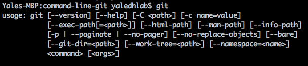

Otherwise, you should be prompted to install xcode. If you're not prompted, you can run `xcode-select --install` to manually install xcode, which will install git for you.

Once that finishes downloading and installing, you should see the commands displayed in the screenshot above when you run `git`.

#### Installing Dependencies on Windows

If you use Windows, the easiest way to install the required dependencies is to download and install [Git Bash](https://git-scm.com/download/win), a Unix-like terminal for Windows. After clicking the link above, click on the installer and accept all defaults.

Once that installs, you should be able to click on the Windows icon in the lower-left-hand corner of your taskbar, search for "Git Bash", and click on the Git Bash icon:

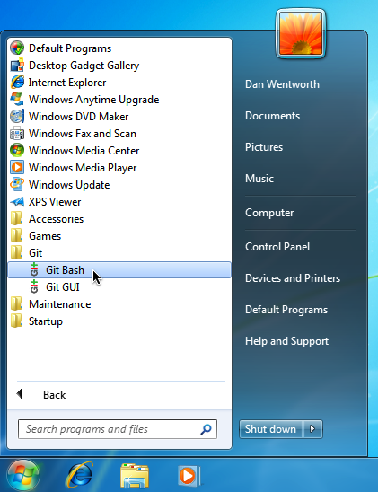

That should bring up a terminal that's fully equipped with Git.

## Introduction to Git

Now that Git's installed, let's cover what Git does. Essentially, Git is a simple tool that keeps track of changes made to files. Git users can tell Git when to add, edit, or delete files in a folder, and how to handle cases where multiple people have edited the same file in different ways.

The core ideas of Git are simple. We start with some files in a <b>workspace</b> (a folder under Git control). We then add those files to a <b>staging area</b> (a representation of the changes we want to keep). Next we commit those changes to our <b>local repository</b> (the copy of our project's content on your machine). Finally, we push those changes from our local repository to our <b>remote repository</b> (the copy of our project's content on a remote server, e.g. on GitHub). Here's a visual representation of this workflow:


To contribute to a project using Git, we only need to `add` files to our staging area, `commit` the changes in our staging area, then `push` those changes up to our remote server. That's all it takes!

## Getting Set Up: Creating a Remote Repository

In order to practice this workflow, we'll need a <b>remote repository</b> to which we can push our changes. Let's go ahead and make that repository on GitHub. To do so, log into <a href='https://github.com'>GitHub</a> then navigate to `https://github.com/new`. This will display an interface that looks like this:

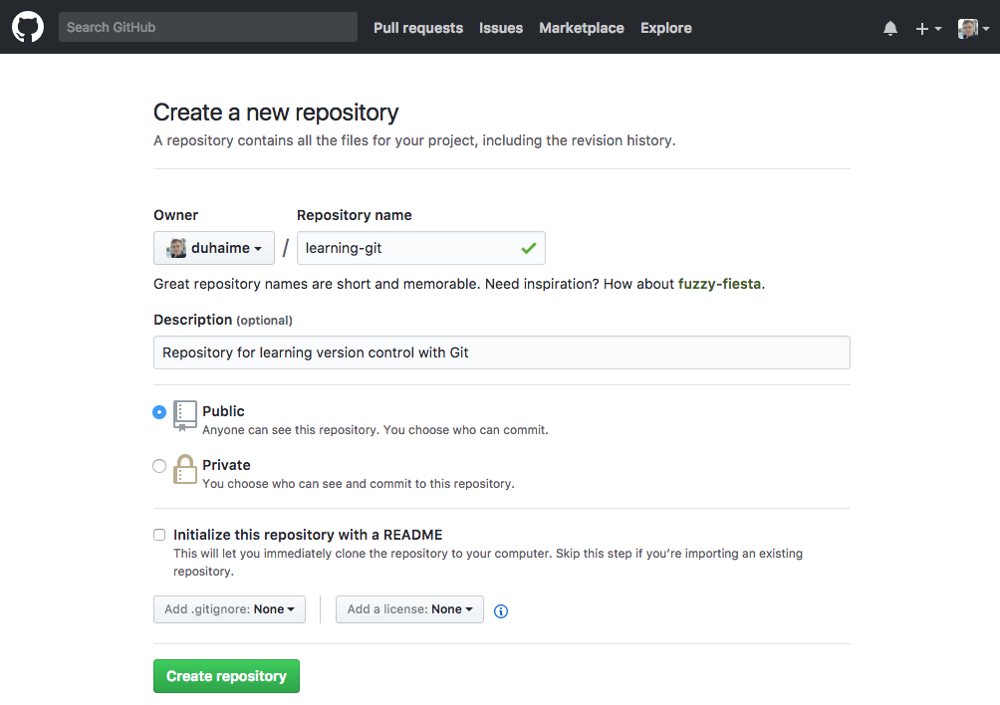

Let's name our new repository 'learning-git', and let's type a short description that outlines the goal of our repository. Once we've filled out those fields, let's click the big green button that says "Create Repository". That will display a screen that looks like this:

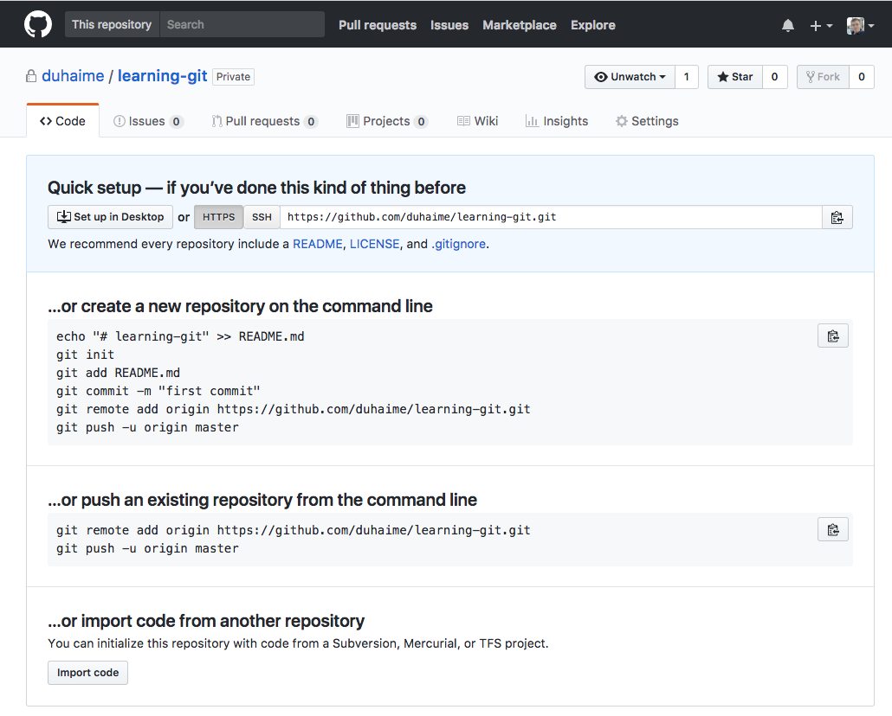

The important line here is the one that says:

```
git remote add origin https://github.com/GITHUB_USERNAME/learning-git.git
```

We'll come back to that url in a moment, so keep this page open.

## Getting Set Up: Creating a Local Repository

In addition to a remote repository, we'll also need a local repository, or a copy of our project's code on our local machine. Our imaginary project doesn't have any content yet, so let's go ahead and make a directory on our machine in which we can store sample project files. To do so, you should be able to open a fresh terminal (on OSX) or Git Bash terminal (on Windows), and type:

```
cd Desktop
```

From there, you can create a new directory by typing:

```
mkdir learning-git
```

Then to move your terminal into that folder let's run:

```
cd learning-git
```

## Initializing a Git Repository

To tell Git that you want to carefully manage the files in a given directory (and its subdirectories), the first command to run is `git init`. That will return a line like the following, which confirms the current directory is ready for git commands:

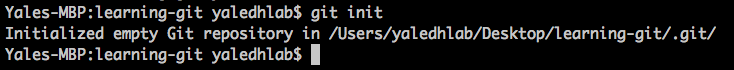

After initializing our current directory, let's run the most important Git command, `git status`. That command will return output that looks like this:

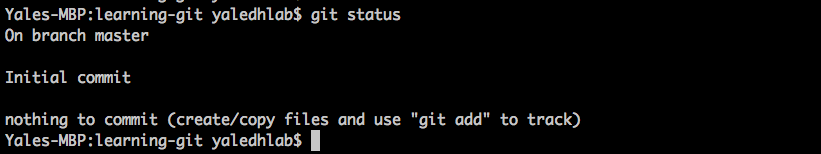

This output tells us some important things:  
 * We're on the `master` branch (we'll discuss branches more below)  
 * We're preparing for our first commit (i.e. we haven't committed anything yet)  
 * There's nothing to "commit" in our directory--because it's empty!  

## Adding Files to Your Staging Area

Let's add a file to our working directory so we have something for Git to manage:

```
touch data.txt
```

That command will generate an empty text file named "data.txt" in your current working directory. After creating that file, let's re-run the `git status` command:

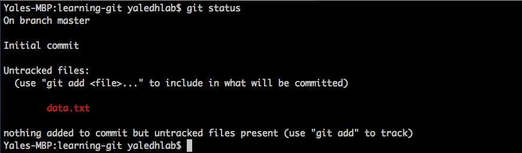

Like above, this status informs us we're still on the master branch and are preparing to make our first commit. However, this git status output differs from the git status output above in one important way--we now have "untracked files"!

Untracked files are files that are present in a Git-enabled directory that have not been "added" to the directory's version control system yet To add a file to your directory's version control system, we can use the following command: `git add FILENAME`. For example, to add our data.txt file to our version control system, let's run:

```
git add data.txt
```

That command doesn't return anything on the terminal. To investigate the change we just made, let's run another `git status`. That returns:

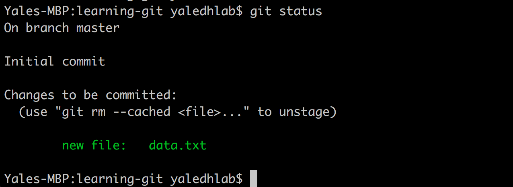

Here we see we have some "changes to be committed"--that is to say, we have some files in our Staging Area.

## Committing Changes to Your Local Repository

Once we have files in our staging area, we can "commit" to those changes and push those changes to our project repository. To commit our changes, we can run:

```
git commit -m 'add data file'
```

This command indicates that we wish to commit all changes in our staging area, and we wish to assign a <b>commit message</b> that says 'add data file'. The commit message is a brief note to yourself and your teammates that indicates what you changed in your commit. Once issued, that command returns the following output:

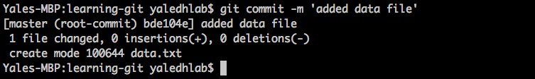

## Pushing Your Local Repository to Your Remote Repository

After commiting your changes, you can push those changes to your remote repository to share the changes with your teammates. 

To do so, we first need to tell Git the address of our remote repository (i.e. the address of our GitHub repository). To do so, we can run the line that we copied above:

```
git remote add origin https://github.com/YOUR_GITHUB_USERNAME/learning-git.git 
```

This line creates an alias named "origin" that points to the http address you specified (i.e. your github repository address). If you're curious, you can see where that alias is stored if you run `cat .git/config`, which will [display](./assets/git-config.png) your Git repository's internal configuration information in your terminal.

After creating an alias for your GitHub repository, you can push your changes to that repository by running:

```
git push origin master
```

This command indicates that you wish to push the `master` branch in your <b>local repository</b> to `origin`, an alias for your <b>remote repository</b> on GitHub.

If you then visit: `http://github.com/YOUR_USERNAME/learning-git` you should see your data file and your commit message:

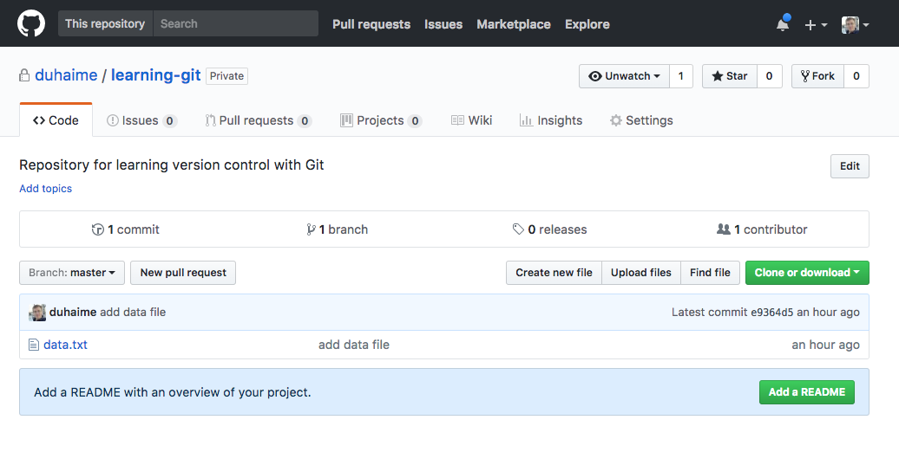

Congratulations--you've just pushed some code to GitHub!

***
#### CHALLENGE

Given what we covered above, see if you can create a new file in your local repository, add that file to your staging area, commit your changes, and push your commit up to GitHub. Feel free to consult the notes above as you do so! 

***

## Understanding the Staging Area

In the example above, we added some files to our <b>staging area</b> by running `git add data.txt`. Let's further explore the <b>staging area</b> by changing our sample data file:

```
echo "hello git" > data.txt
```

If you now open data.txt in a text editor, you'll see that it now contains some content. If you run a `git status` command, you'll see that Git is aware your file changed:

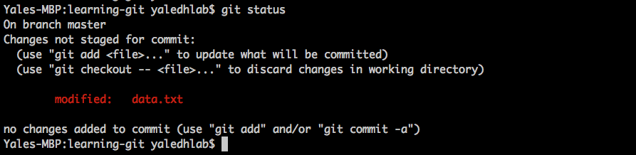

Let's add a new file as well:

```
touch secret.json
```

And run another `git status`:

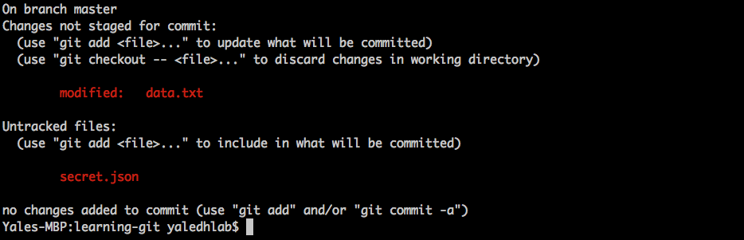

Here we see that we have made changes to our data.txt file, and have a new "untracked" file, secret.json. Let's add secret.json to our staging area:

```
git add secret.json
```

And run another `git status`:

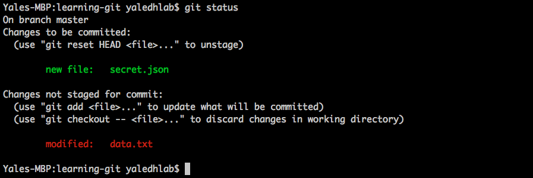

Now let's suppose we want to remove secret.json from our staging area. To do so, we can use the `git reset` command:

```
git reset secret.json
```

And run another `git status`:

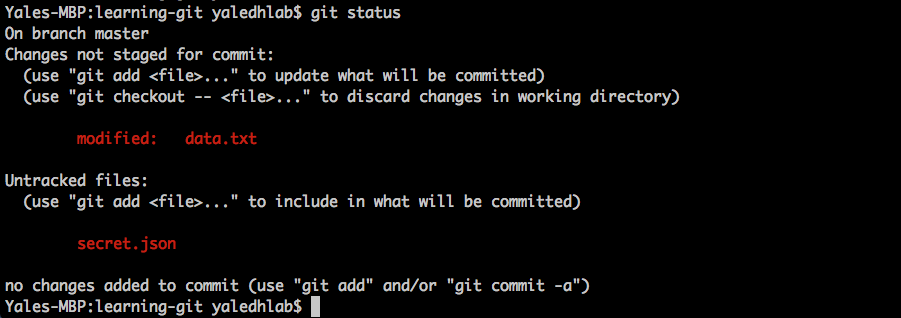

As we can see, this removed secret.json from our staging area, which is now empty (hence the "no changes added to commit" in the git status response above).

This is just to say, we can add files to our staging area with `git add`, and can remove those files from our staging area with `git reset`.

***
#### CHALLENGE

Given what we covered above, see if you can add data.txt to your staging area, then see if you can remove it from your staging area. Once you're done, add all of your local files to your staging area and push them to GitHub.

***

## Pulling from a Remote Repository

So far we've made changes in our local respository and have then pushed those changes up to our remote repository on GitHub. Sometimes, however, your remote repository will have changes that are not present in your local repository. (For example, teammates could push changes to the remote repository, or you yourself might push changes to the remote repository from another machine.) In those situations, you'll want to "pull" those changes down to your local repository so that your local repository matches the remote repository.

Let's create some changes on your remote repository that aren't present in your local repository. To do so, let's navigate to `https://github.com/YOUR_USER_NAME/learning-git` and click the button that says "Create new file". Add a name and some content to your file then click the big green button at the bottom of the page that says "Commit new file". After doing so, you should see your new file in your repository.

If you run `ls` in your terminal, you'll note that that new file is not present in your local repository. Let's pull that file into your local repository. To do so, we can run:

```
git pull origin master
```


## Git Log

To review all commits made in your repository and their associated commit messages, we can run `git log`:

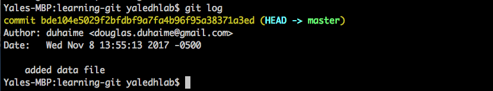

To exit that view, just hit `q`.

## Storing Your GitHub Information

Rather than type out your GitHub username and password when pushing code to GitHub, it's helpful to save this information on your system. To do so, you can run:

```
git config --global user.name "Emma Paris"
git config --global user.email "eparis@atlassian.com"
```

## Working with 2FA

## Cleaning Up Branches

```
git branch -a
git branch -D BRANCH_NAME
alias gs='git status'
alias git-prune='git remote prune origin'
alias git-delete-merged='git branch --merged | egrep -v "(^\*|master|gh-pages)" | xargs git branch -d'
```

## Hooks

## Git Cheatsheet

The following offers a brief overview of some of the most commonly used git commands:

```
git init         # initialize a git repository in your cwd 
git add          # add a file to your git commit
git commit -m    # commit the files you've added 
git push         # push your committed changes elsewhere
git status       # check the status of your git branch
git pull         # update your current branch
git checkout -b  # switch to a different branch
git diff         # compare updates you've made to 
git reset        # remove a file from a git add
git branch -a    # list all branches
git log          # show a log of all commits to branch
git clone        # clone a remote repo
```

